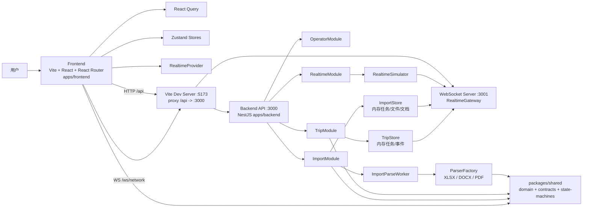
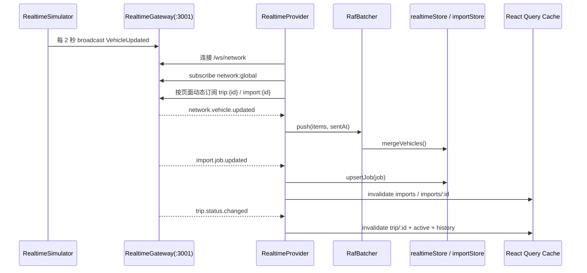
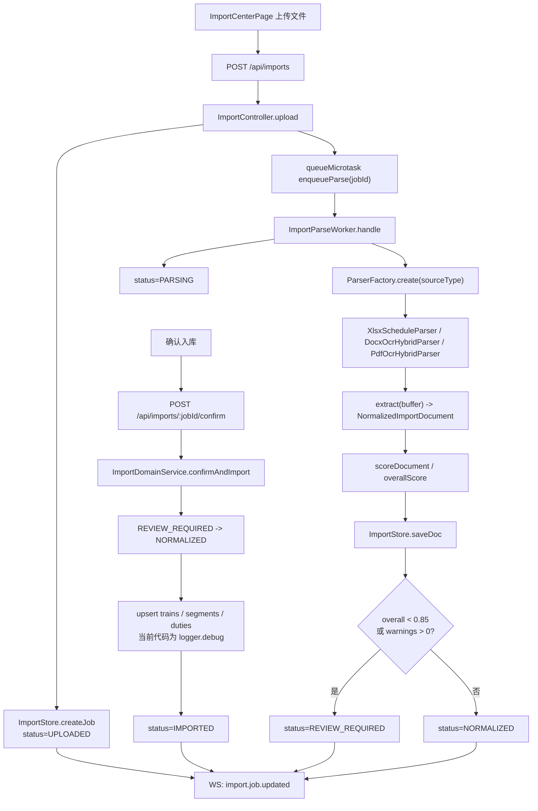
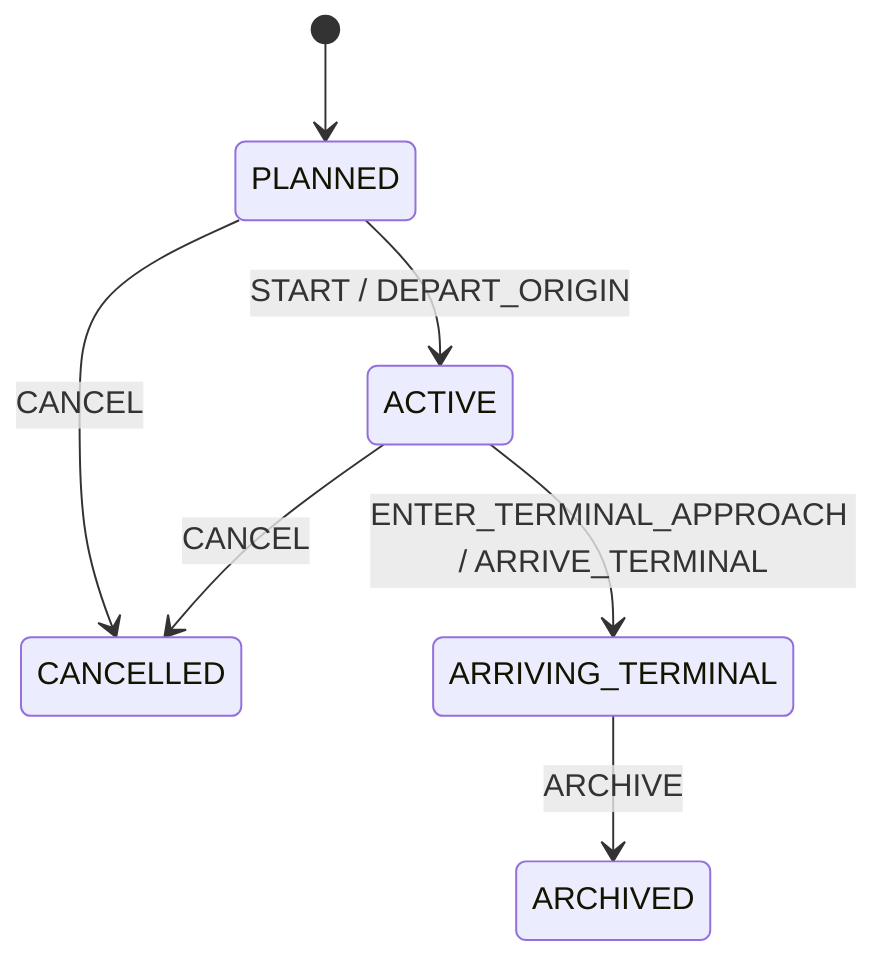
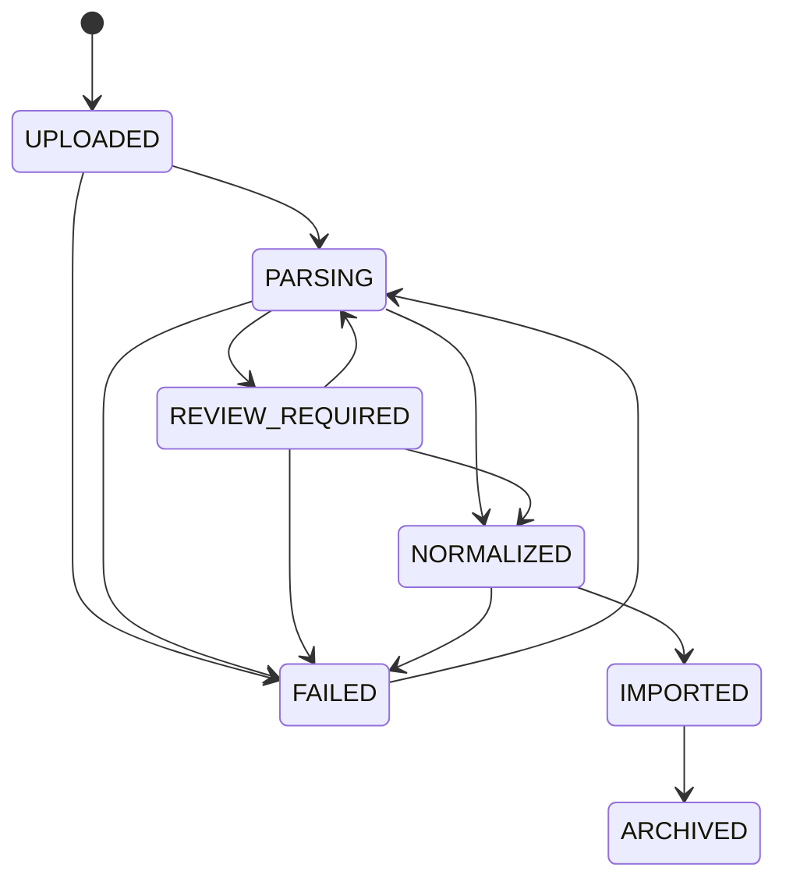

# Code Visualization

基于当前代码整理，不引用方案稿假设。

## 1. 系统结构图

## 2. 前端页面与数据关系

```mermaid
flowchart TD
    APP["AppShell"] --> DASH["/ DashboardPage"]
    APP --> GRAPH["/running-graph RunningGraphPage"]
    APP --> ATTACHED["/attached-route/:tripId AttachedRoutePage"]
    APP --> SCHEDULE["/master-schedule MasterSchedulePage"]
    APP --> HISTORY["/history-trips HistoryTripsPage"]
    APP --> IMPORTS["/imports/:jobId? ImportCenterPage"]

    DASH --> OPAPI["GET /api/operators/me"]
    DASH --> RTSTORE["realtimeStore.vehiclesById"]

    GRAPH --> RTSTORE

    ATTACHED --> TRIPDETAIL["GET /api/trips/:tripId"]
    ATTACHED --> TRIPSTART["POST /api/trips/:tripId/start"]
    ATTACHED --> TRIPARRIVE["POST /api/trips/:tripId/arrive-terminal"]
    ATTACHED --> TRIPARCHIVE["POST /api/trips/:tripId/archive"]
    ATTACHED --> APPSTORE["appStore.selectedTripId"]

    SCHEDULE --> ACTIVE["GET /api/trips/active"]
    SCHEDULE --> NAVHISTORY["跳转 history-trips<br/>携带 trainNo/routeId/scheduleVersionId"]

    HISTORY --> HQS["historyQueryStore"]
    HISTORY --> HISTORYAPI["GET /api/trips/history?..."]

    IMPORTS --> IMPORTLIST["GET /api/imports"]
    IMPORTS --> IMPORTDETAIL["GET /api/imports/:jobId"]
    IMPORTS --> IMPORTPREVIEW["GET /api/imports/:jobId/preview"]
    IMPORTS --> IMPORTUPLOAD["POST /api/imports"]
    IMPORTS --> IMPORTCONFIRM["POST /api/imports/:jobId/confirm"]
    IMPORTS --> IMPORTSTORE2["importStore.currentJobId"]

    WSCLIENT["RealtimeProvider"] --> RTSTORE
    WSCLIENT --> IMPORTSTORE2
    WSCLIENT --> APPSTORE
```

## 3. 实时链路

## 4. 导入链路

## 5. 车次状态机

## 6. 导入任务状态机

## 7. 代码里的主事实

- 前端走 `:5173`，HTTP 代理到 `:3000`，WebSocket 代理到 `:3001`
- 后端 `TripStore`、`ImportStore`、`RealtimeSimulator` 目前都是内存实现
- `packages/shared` 是前后端共用契约中心，承载 `domain`、`REST/WS contracts`、`state-machines`
- 实时消息目前有 3 类真正被前端消费：`network.vehicle.updated`、`import.job.updated`、`trip.status.changed`
- 导入“确认入库”目前没有真实数据库写入，代码只做状态推进和 `logger.debug`
